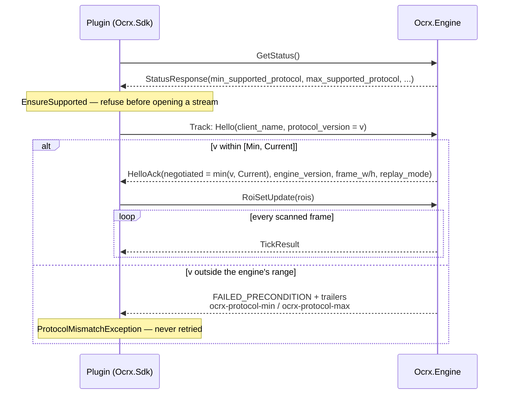

# Capture protocol

The contract between the capture engine (one process, owns the screen and the OCR pipeline) and its
plugins (one process each, own their trackers). It is defined by `protos/capture.proto`; this
document states the parts of it that are agreements rather than message shapes — what a field means,
who is allowed to break what, and which guarantees a plugin may rely on.

Governance: `buf.yaml` at the repo root plus the `proto-guard` job in `.github/workflows/ci.yml`.
Every PR is linted and compared against `master` with `buf breaking` at `WIRE_JSON` level, so a
field cannot be deleted, renumbered or retyped without CI going red.

Public integration guidance lives in the [OCRX documentation](https://ocrx.org/docs). Engine
implementation details remain private; the protocol source and compatibility rules remain public here.

## Transport

| | |
| --- | --- |
| Endpoint | Windows named pipe, default `OCRX.Engine` (`Ocrx.Contracts/PipeContract.cs`) |
| Override | engine `--pipe <name>` / `%LOCALAPPDATA%\OCRX\engine-config.json`; each plugin's `config.json` must match |
| Protocol | gRPC over HTTP/2, prior knowledge (`GrpcHost.cs:38` forces `HttpProtocols.Http2`) |
| Security | Plaintext. A pipe carries no TLS to negotiate with; it inherits the logon session's ACL, and the engine is a per-user process |
| Connections | One channel per plugin process (`NamedPipeChannel.Create`), one `Track` stream per channel |

A pipe that nobody serves makes the dial *block* rather than fail, which is why the SDK bounds it
(`SocketsHttpHandler.ConnectTimeout`, 5 s) and why `CaptureClient.WaitForEngineAsync` polls
`GetStatus` instead of assuming a connect failure means "no engine".

## Handshake

Rules, both sides:

- **Hello first.** The handshake window closes at the first non-`Hello` message; a client that opens
  with a `RoiSetUpdate` is served ticks but never acknowledged (`CaptureGrpcService.cs:112`). A
  second `Hello` cannot renegotiate — the version is settled and the ack has already gone out.
- **`protocol_version = 0` means a pre-versioning client** and is read as 1.
- **The ack precedes every tick on the wire**, not merely by intent: it travels beside the tick
  channel, because a live client's channel evicts its *oldest* entry under pressure and the oldest
  entry would be the ack itself.
- **The SDK awaits the ack before subscribing** (`CaptureClient.TrackAsync`), so a refusal surfaces
  as the mismatch it is instead of as a failed write on the ROI update. A tick arriving before the
  ack, or an acknowledged version above what the client announced, is a peer bug →
  `SessionFaultedException`. No ack within 10 s → `TimeoutException` (retry the connect).
- **A stream that ends before the ack is not a fault.** That is an engine shutting down mid-connect;
  `Ticks` simply completes.
- **Rejection is not retryable.** Two running processes do not change version, so the SDK raises
  `ProtocolMismatchException` on the first answer rather than polling on.

## Version policy

One unsigned integer, `Ocrx.Contracts/ProtocolVersion.cs` (`Current`, `Min`; both 1 today). It is
independent of the assembly/package version — this is the go-plugin model: artifact versions say what
was built, the protocol version says what can talk to what.

- **Bump `Current` only for a breaking change in wire semantics**: a field's meaning changed, a
  required interaction was added or reordered, a value's interpretation changed.
- **Never bump for additive change.** New messages, new fields, new enum values, new RPCs are all
  invisible to an older peer by proto3 rules and are handled by the compatibility rules below.
- **Raise `Min` only to drop support** for a version the engine will no longer serve. That strands
  every plugin below it, deliberately and loudly (FAILED_PRECONDITION with the range in trailers).
- The engine advertises `[Min, Current]` on `GetStatus`; the SDK checks the range before opening a
  stream, and the negotiated version is `min(client, engine Current)` — exposed to the plugin as
  `TrackSession.NegotiatedProtocol`.

For which protocol/engine/SDK versions actually shipped together, and the release checklist for
recording a new one, see [`docs/COMPATIBILITY.md`](COMPATIBILITY.md).

## Compatibility rules

- **Unknown fields are preserved and ignored** (proto3). A newer engine may fill fields an older
  plugin has never heard of; nothing is dropped and nothing fails.
- **Unknown `oneof` arms are skipped, not treated as empty.** `TrackSession.Ticks` forwards only
  `MsgCase == Tick` and `continue`s past anything else, which is what makes adding a response kind an
  additive change. A plugin reading `response.Tick` unconditionally would see a default-constructed
  tick instead.
- **`RoiResultKind.ROI_RESULT_KIND_UNSPECIFIED` means "engine older than this field"** (or an error
  result), never "text". That is why `kind` is not a `RoiMode`: `RoiMode`'s zero is
  `ROI_MODE_TEXT`, so reusing it would make a pre-`kind` engine claim every result was text.
- **`RoiSpec.scale = 0` means "engine default"** (1.0, `WireLimits.NormalizeOcrScale`) because proto3
  cannot distinguish an unset double from 0. The engine reports what it actually applied in
  `RoiResult.effective_scale`, which is `> 0` on every successful result.
- **Check `RoiResult.error` first.** On an error result every payload field is unset, and an empty
  `text` is not the same as a successfully read empty panel. On the SDK side this is
  `TickData.Status` / `TryGetText`, whose `false` cannot be mistaken for a reading the way `""` can.
- **`StatusResponse.scan_interval_ms = 0` means "engine older than this field"**, not a zero-length
  cadence. The value is the interval the scan loop actually sleeps for, after the engine's own
  minimum clamp — so a plugin expressing a debounce in ticks reads it instead of assuming 250 ms.
  `EngineInfo.ScanInterval` falls back to `EngineDefaults.DefaultScanInterval` on the zero.

## Coordinate spaces

Two spaces travel the wire, and every rect field in `capture.proto` documents which one it is in.

| Space | Definition | Fields |
| --- | --- | --- |
| REFERENCE | 2560x1440, the resolution all ROIs are calibrated at (`RoiScaler`) | `RoiSpec.rect`, `DumpFrameRequest.roi` |
| FRAME | Actual capture pixels of the monitor | `RoiResult.frame_rect`, `TickResult.frame_width/height` |
| Crop | The upscaled OCR crop, origin at the ROI | `OcrWord.crop_rect` |

**The engine does all scaling** (`ScanLoop.ReadOneAsync`): a client declares reference-space ROIs and gets
back the frame-space rect that was actually read, after scaling and clamping. A plugin must never
re-scale a rect the engine reported — double-scaling produces coordinates that are wrong but
plausible. A reference ROI that cannot touch the frame at all is rejected per-ROI rather than
clamped to a meaningless sliver (`ScanLoop.EnsureRoiInFrame`).

## Tick atomicity

Everything a plugin needs for one decision arrives in one `TickResult` read from one frame. This is
structural, not conventional: all OCR in the engine happens in `ScanLoop`, one frame at a time, and
each client's ROI set is swapped whole rather than mutated, so a tick can never straddle two frames
or two subscriptions.

- Every ROI in the client's set at tick time is answered in that tick — success or per-ROI error.
- A failing ROI never removes another ROI's result, for that client or any other.
- A `ROI_MODE_PIXELS` payload is capped at 256 KiB (`WireLimits.MaxPixelBytes`). gRPC's 4 MiB receive
  limit applies to the whole `TickResult`, so an unbounded pixel ROI would sink the entire tick;
  oversized ROIs get a per-ROI error instead.
- `RoiSetUpdate` is a **full replacement** and idempotent. An empty set is a legitimate state
  (heartbeat-only client), not "not ready".
- `TickResult.manual` is read once per frame, so two plugins can never disagree about whether the
  hotkey fired on it.

## Backpressure and stream end

Each subscription has a bounded outbound channel of **4 ticks** (`ClientSubscription.cs:18`, ~1 s at the
default 250 ms cadence). The overflow policy depends on the frame source:

| Mode | Policy | Why |
| --- | --- | --- |
| Live | `DropOldest` | The freshest screen state is the only one worth acting on; a slow plugin must never stall the scan loop or the other plugins. |
| Replay | `Wait` | A dropped frame changes the outcome, and determinism is the whole point of a corpus run. |

A plugin that falls behind in live mode therefore sees a **frame-sequence gap in `frame_seq`**, never a stale
backlog — `frame_seq` is monotonic per scanned frame and is the only way to detect the drop.

Replay adds a start gate: the engine does not consume the corpus until at least one client has sent
a `RoiSetUpdate`, so a run cannot silently produce nothing. When the corpus is exhausted or the
engine shuts down, every `Track` stream is **completed normally** — `Ticks` ends, and a plugin runs
its finalisers. A dropped pipe instead surfaces as `RpcException(Unavailable)`, and the plugin (or,
from TASK-07, the plugin host) decides whether to reconnect; the SDK deliberately has no reconnect
logic of its own, so a tracker's state machine cannot keep running across an engine restart it never
learned about.
